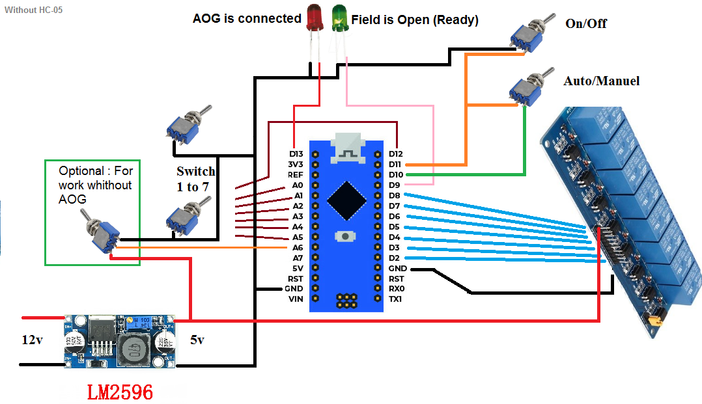
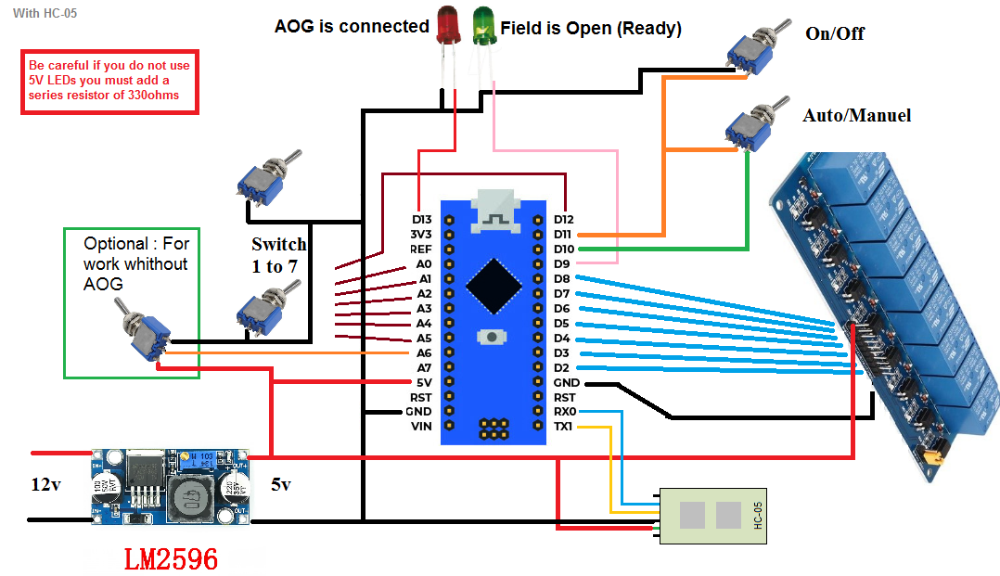

# Section Control for AgOpenGPS

Section control by external box for AgOpenGPS. Fairly simple code designed to work with switches.

# Hardware USB

Be careful if you do not use 5V LEDs you must add a series resistor of 330ohms!

# Hardware Bluetooth

Be careful if you do not use 5V LEDs you must add a series resistor of 330ohms!

By simply using an HC-05 module you will be able to connect to the module in bluetooth. You must first configure your module at a speed of 38400 Bauds (To do this there are many tutorials on the internet).

# Hardware Ethernet

Be careful if you do not use 5V LEDs you must add a series resistor of 330ohms!

By using this code and a USR-TCP232-T2 ethernet module you can connect your box in UDP. To configure you can refer to this discussion https://discourse.agopengps.com/t/f9p-in-ethernet-mode .Please set baud to 38400 not 115200 and local port to 8888 rather than 2223!

Below is what you need to have in the USR configuration:

wiring diagram:

# Mode Without AOG

to use the box without AOG:
 _No connection should be established
 _Switch from Manual to Off mode at least 5 times in less than 5s
 _The LEDs start flashing for approximately 10s (stay in the off position)
 _once the green LED remains fixed. you can use mode without AOG

Any connection with AOG immediately deactivates this mode.