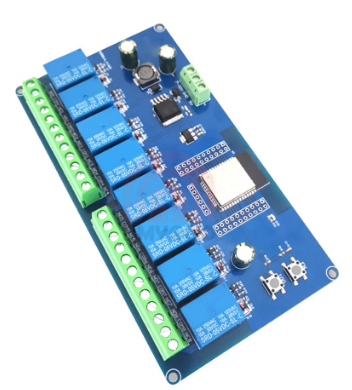

# Section Control for AgOpenGPS

Section control by external box for AgOpenGPS. Fairly simple code designed to work with switches.

# Hardware

This code can be used directly with these brochures sold on food...

https://a.aliexpress.com/_Ewm7fKz

# Mode Without AOG

to use the box without AOG:
 _No connection should be established
 _Switch from Manual to Off mode at least 5 times in less than 5s
 _The LEDs start flashing for approximately 10s (stay in the off position)
 _once the green LED remains fixed. you can use mode without AOG

Any connection with AOG immediately deactivates this mode.