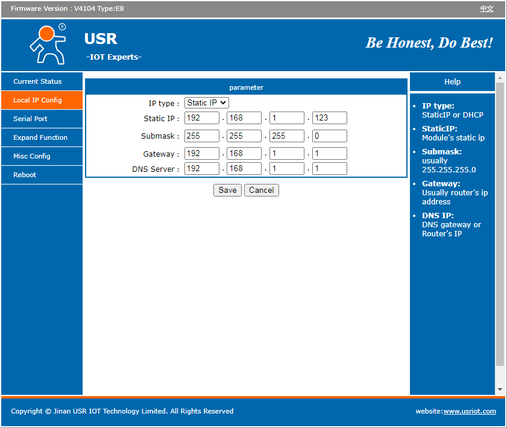
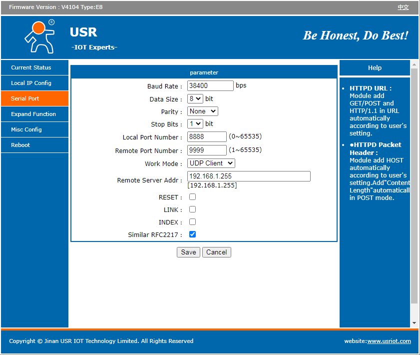
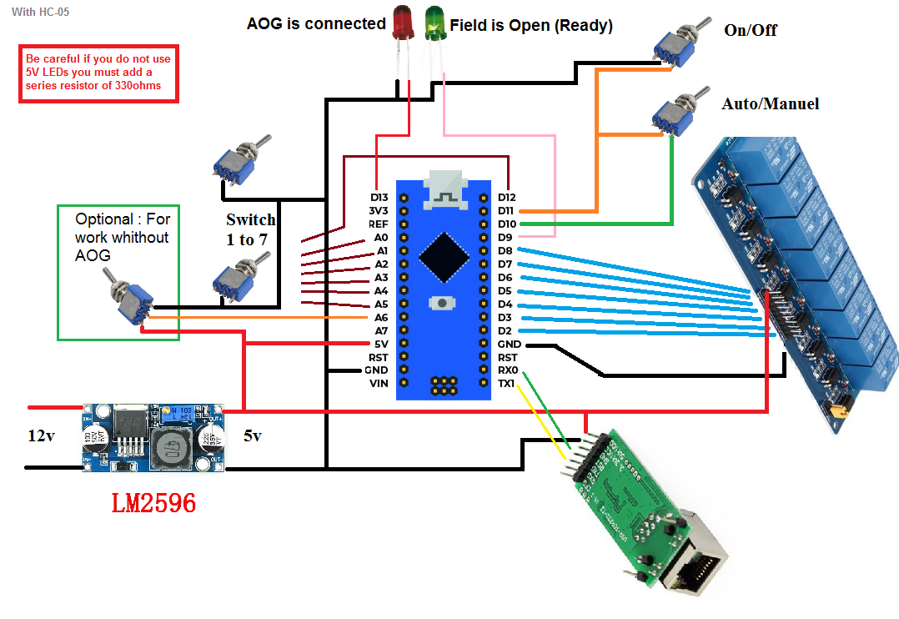

# Section-Control-for-AgOpenGPS

Section control by external box for AgOpenGPS. Fairly simple code designed to work with switches.

To use the box without connection to AOG you can add a switch as shown in the diagram and uncomment this line:
//#define WORK_WITHOUT_AOG //Allows to use the box without aog connected (optional)

# Hardware
Be careful if you do not use 5V LEDs you must add a series resistor of 330ohms!

By using this code and a USR-TCP232-T2 ethernet module you can connect your box in UDP. To configure you can refer to this discussion https://discourse.agopengps.com/t/f9p-in-ethernet-mode .Please set baud to 38400 not 115200 and local port to 8888 rather than 2223!

Below is what you need to have in the USR configuration:

wiring diagram:
